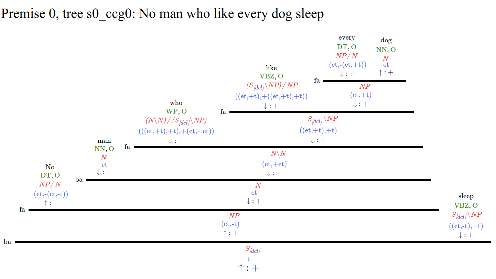

# ccg2mono
Authors: Hai Hu, Larry Moss

## Description
This program takes in raw sentences and add monotonicity information to every constituent.

For example:

- input sentence: No man who likes every dog sleeps. 

- output: No&uarr; man&darr; who&darr; likes&darr; every&darr; dog&uarr; sleeps&darr; .&uarr; (arrows on non-terminal nodes too)

- visualized output:



How it's done:

- Input sentences are first parsed using any of the 3 CCG parsers (C&C, easyccg, depccg)
- ccg2mono reads in the CCG parse and polarize using the algorithm described in this [paper](https://www.aclweb.org/anthology/S18-2015.pdf).
- Visualize output using scripts from ccg2lambda.

Caveats:

- ccg2mono depends on the correctness of the CCG parse. If the parse is wrong, then the polarized sentence is almost certainly wrong. The above tree is parsed by easyccg, which is trained on the rebanked CCG and thus correctly parses the relative clause. C&C and depccg are trained on the original CCGbank and outputs wrong relative clauses: ((no man) (who likes every dog)). ccg2mono includes some functions to correct the parses, but cannot guarantee that all mistakes are corrected. So a good thing is to try all three parsers. 

## Preparation
You need several things to run our program. **You can follow the commands [below](https://github.com/huhailinguist/ccg2mono#preparation-scripts).**

1. Clone this repository to your computer. Have Python 3.5 installed. Install the `beautifulsoup4` python package; you can do `pip3 install beautifulsoup4` or `conda install beautifulsoup4` if you use anaconda. 

2. Install C&C parser. 
All you need is download the precompiled binaries and the models 
(models trained on CCGbank 02-21 and MUC 7, 50MB) from the [webpage](http://www.cl.cam.ac.uk/~sc609/candc-1.00.html). 

2. Install easyCCG parser. You can simply clone [easyCCG](https://github.com/mikelewis0/easyccg) to your machine. 

3. Install ccg2lambda system. You can simply clone [ccg2lambda](https://github.com/mynlp/ccg2lambda) 
to your machine. 

4. Install depccg parser. Follow instructions [here](https://github.com/masashi-y/depccg) or the commands [below](https://github.com/huhailinguist/ccg2mono#preparation-scripts).

4. Install some more python packages (for visualizing trees in ccg2lambda) by 
typing `pip3 install lxml simplejson pyyaml`.

5. Modify two scripts in ccg2lambda system. Simply copy the two python scripts in *files_for_ccg2lambda* to the folder *$ccg2lambda/scripts/* and replace the original files, where *$ccg2lambda* is the directory where you cloned ccg2lambda from step 3. This is to enable visualization of the arrows used in this project. 
   
6. Finally copy the paths of the above three programs (the CandC binaries and models, easyccg, and ccg2lambda) to *src/parse.sh* lines 27-31.

Then you are ready to go. 

## Preparation scripts

Assume you are on mac or linux.

```bash
mkdir ccg; cd ccg # make a directory to put all repositories

# clone repos
git clone https://github.com/huhailinguist/ccg2mono.git
git clone https://github.com/mikelewis0/easyccg
git clone https://github.com/mynlp/ccg2lambda

# install depccg parser and spacy
pip3 install cython numpy depccg spacy
depccg_en download
python -m spacy download en

# download C&C binaries
wget https://www.cl.cam.ac.uk/~sc609/resources/candc-downloads/candc-linux-1.00.tgz  # linux
wget https://www.cl.cam.ac.uk/~sc609/resources/candc-downloads/candc-macosxu-1.00.tgz # mac
tar zxvf candc-linux-1.00.tgz

# download C&C models
cd candc-1.00
wget https://www.cl.cam.ac.uk/~sc609/resources/candc-downloads/models-1.02.tgz 
tar zxvf models.-1.02.tgz
cd ..

# change scripts in ccg2lambda
cp ccg2lambda/scripts/visualization_tools.py ccg2lambda/scripts/visualization_tools.bak.py 
cp ccg2lambda/scripts/visualize.py ccg2lambda/scripts/visualize.bak.py 
cp ccg2mono/files_for_ccg2lambda/visualization_tools.py ccg2lambda/scripts/
cp ccg2mono/files_for_ccg2lambda/visualization_tools.py ccg2lambda/scripts/

# install other packages
pip3 install beautifulsoup4 lxml simplejson pyyaml
```

In the end, you will have the following file structure:

```bash
ccg
|-- ccg2mono
|  |-- src
|-- ccg2lambda
|-- candc-1.00
|  |-- bin
|  |-- models
|-- easyccg
```

and also installed depccg. 

## Usage

### polarize and visualize

`src/parse.sh` is a shell script that does parsing, polarizing and visualization all together. 

```bash
./parse.sh sentences.txt parser
```

where parser can be: `candc`, `easyccg`, `depccg`.

Depending on the parser you selected,  you will see
`sentences.txt.candc_pretty.html`, `sentences.txt.easyccg_pretty.html`
or  `sentences.txt.depccg_pretty.html`, which is the polarized 
output shown in the image above. 

A text file containing polarized sentences will be saved to:
`FILENAME.PARSER.parsed.(xml|txt).polarized`.

## Algorithm

Our algorithm is described in this [paper](https://www.aclweb.org/anthology/S18-2015.pdf).

## infer (deprecated; will be uploaded to another repository)
*infer.py* first reads in 3 knowledge representations from the folder k:

- pairs.txt: dog < animal, beat < touch, etc.
- subsecAdj.txt: subsective adjectives such as good, bad, tall, etc.
- sentences4k.txt: sentences with "isA" relations such as "John is a cat."

It will then build a knowledge base on the above information (see our second paper
 below for details).
 
Finally, it will do inference using simple substitution, or replacement. 
Thus if the input sentence is "every&uarr; cat&darr; likes&uarr; some&uarr; good&uarr; dog&uarr;",
one replacement will result in inferences such as:

- every&uarr; cat&darr; likes&uarr; some&uarr; good&uarr; animal&uarr;
- every&uarr; cat&darr; likes&uarr; some&uarr; dog&uarr;

two replacements will result in:

- every&uarr; cat&darr; likes&uarr; some&uarr; animal&uarr; 

## TODO
[done] Add visualization to the final monotonicity output.

Handle more cases in inference.

## Cite
```
@inproceedings{hu-moss-2018-polarity,
    title = "Polarity Computations in Flexible Categorial Grammar",
    author = "Hu, Hai and Moss, Lawrence S.",
    booktitle = "Proceedings of the Seventh Joint Conference on Lexical and Computational Semantics",
    month = jun,
    year = "2018",
    address = "New Orleans, Louisiana",
    publisher = "Association for Computational Linguistics",
    url = "https://www.aclweb.org/anthology/S18-2015",
    doi = "10.18653/v1/S18-2015",
    pages = "124--129"
}
```

Or this which has a description of how _inference_ work in our system:
 
```
@inproceedings{monalog,
	title={\textbf{{MonaLog}: a Lightweight System for Natural Language Inference Based on Monotonicity}},
	author={\textbf{Hu, Hai} and Chen, Qi and Richardson, Kyle and Mukherjee, Atreyee and Moss, Lawrence S and Kuebler, Sandra},
	booktitle={Proceedings of the Society for Computation in Linguistics 2020},
	year={2020}
}
```

